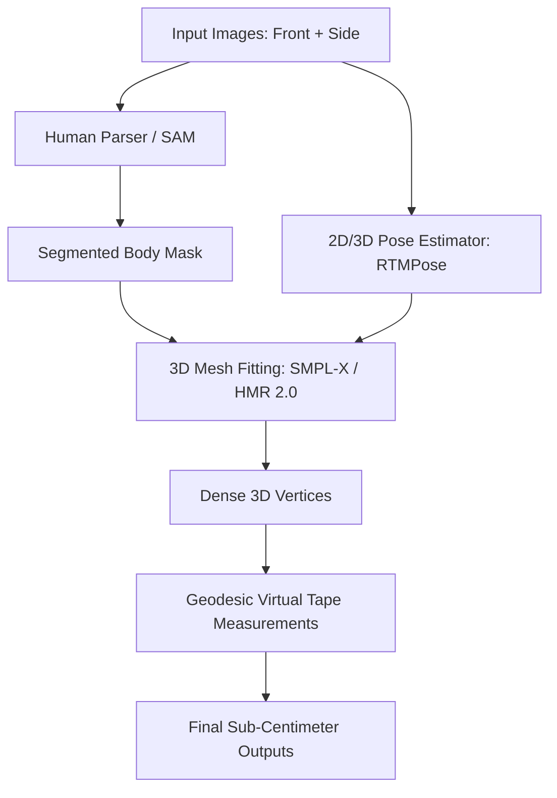
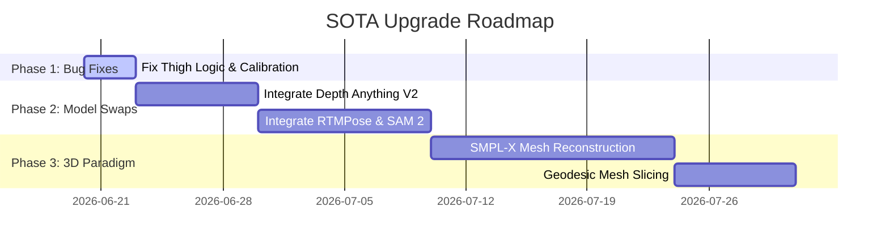

# Engineering Proposal: State-of-the-Art (SOTA) 3D Body Measurement System

This document outlines the architectural, model-level, and algorithmic transformation required to elevate the accuracy of the current 2D-based body measurement system to a **State-of-the-Art (SOTA)** level. 

---

## 1. Core Architectural Shift: From 2D Ellipses to 3D Human Mesh Recovery (HMR)

The current system relies on **MediaPipe (2D keypoints)** and **MiDaS (2D depth map)** to construct 2D elliptical slices of the body. This approach has critical geometric limitations (e.g. failing to capture natural muscle/fat distribution, posture variations, and body rotation).

To achieve sub-centimeter accuracy, we must transition to a **3D Human Mesh Recovery (HMR)** paradigm, which reconstructs a dense 3D model of the human body from one or more images.

### Proposed SOTA Technologies:

*   **SMPL-X (Skinned Multi-Person Linear model)**: A statistical body model representing the human body shape, posture, hands, and face using a vector of shape parameters ($\beta$) and pose parameters ($\theta$).
*   **HMR 2.0 / CLIFF**: SOTA models that can reconstruct the full 3D body mesh from a single in-the-wild image by predicting the camera parameters and SMPL parameters simultaneously.

---

## 2. Advanced Vision Models Upgrade

| Pipeline Stage | Current Model | Proposed SOTA Model | Why it represents SOTA |
| :--- | :--- | :--- | :--- |
| **Pose Estimation** | MediaPipe Pose | **RTMPose / ViTPose** | ViTPose uses Vision Transformers (ViT) to achieve the highest AP (Average Precision) on COCO keypoint detection, remaining robust against body turns, self-occlusion, and loose clothing. |
| **Depth Estimation** | MiDaS (Small) | **Depth Anything V2 (Large)** | Depth Anything V2 produces exceptionally sharp, high-resolution relative/metric depth maps with clean boundaries, solving the blurry edge issues that distort width-to-depth calculations. |
| **Body Segmentation** | Contour detection (Canny) | **Segment Anything 2 (SAM 2) + Human Parsing (Graphonomy)** | Graphonomy performs pixel-level labeling of body parts (e.g., separating torso, left arm, right thigh). SAM 2 produces sharp, pixel-perfect boundaries even in poor lighting. |

---

## 3. Algorithmic Enhancements for Maximum Precision

### A. Geodesic Distance vs. Elliptical Approximation
*   **Current Method**: Circumference is calculated using Ramanujan's ellipse approximation:
    $$C \approx \pi \left[ 3(a+b) - \sqrt{(3a+b)(a+3b)} \right]$$
*   **SOTA Method**: Once the 3D mesh (SMPL-X) is reconstructed, we slice the mesh with a 3D plane at key landmarks (e.g. waist, chest, hip) and compute the **geodesic distance** (the shortest path along the curved 3D surface vertices). This captures exact physical curvature instead of assuming an ellipse.

### B. Clothing Subtraction (Body-under-Cloth Estimation)
Loose clothing introduces massive measurement overestimations.
*   **Statistical Shape Fitting**: Using the reconstructed 3D mesh, we can run optimization loops (e.g., **DeepFashion3D** or **CAPE**) that fit the underlying SMPL body model *under* the boundary constraints of the clothed silhouette, effectively peeling away the clothes mathematically.

### C. Active Camera Calibration
*   **Focal Length Estimation**: Instead of hardcoding focal length ($600$), we can parse the **EXIF metadata** of the uploaded JPEG to extract the camera's actual focal length and sensor width, or run an auto-calibration algorithm using the ground plane orientation.

---

## 4. Input Quality & UX Feedback Loop

Even the best AI models fail if the input photos are taken from the wrong angle or with poor posture. We should implement a **Smart Capture Engine** in the frontend:

> [!TIP]
> **Real-time Guidance Indicators**:
> *   **Gyroscope alignment**: Ensure the phone is held perfectly perpendicular to the ground ($90^\circ \pm 2^\circ$) to eliminate perspective distortion.
> *   **Pose validation**: Run a lightweight pose model (e.g. MediaPipe in-browser) to verify the user is standing in an **A-pose** (arms $30^\circ$ away from body, legs shoulder-width apart) before allowing them to take the photo.

---

## 5. Implementation Roadmap (Iterative Steps)

To transition your codebase systematically, we suggest the following phases:

